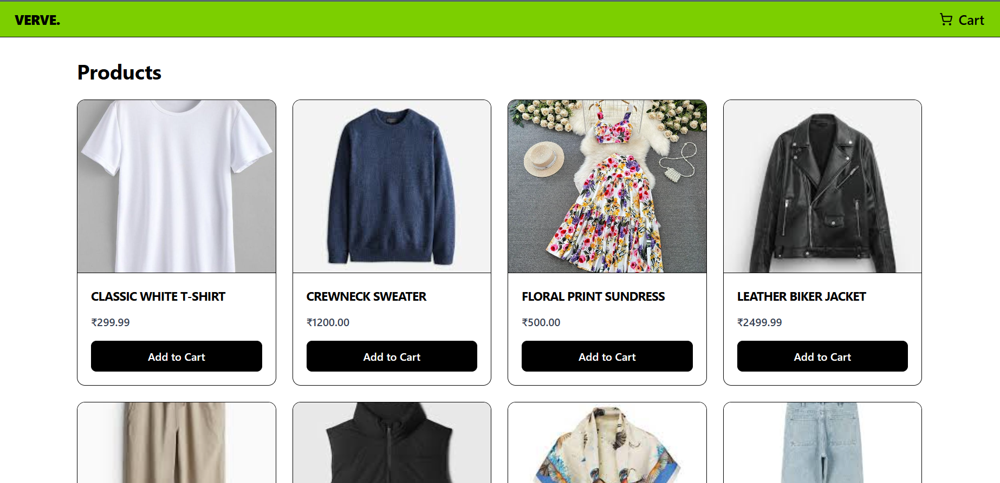
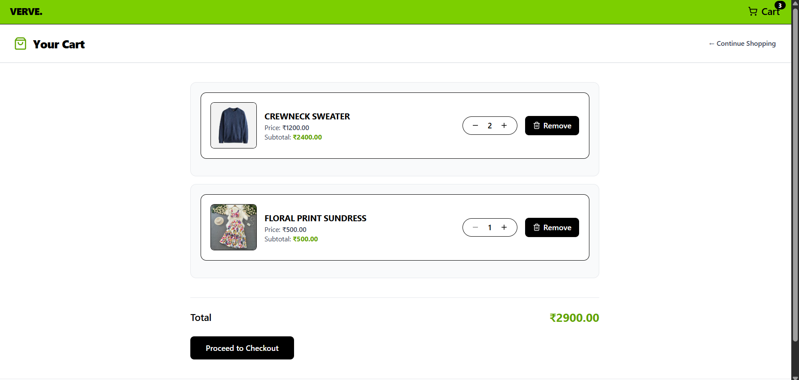
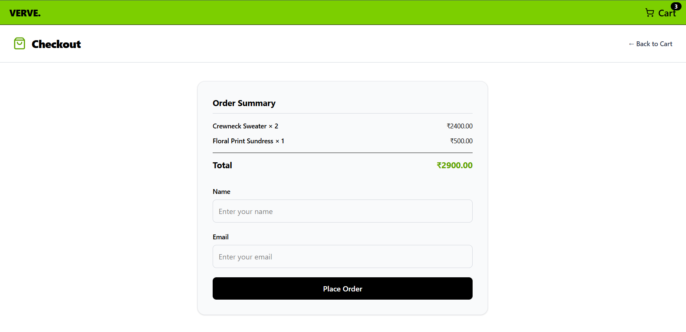
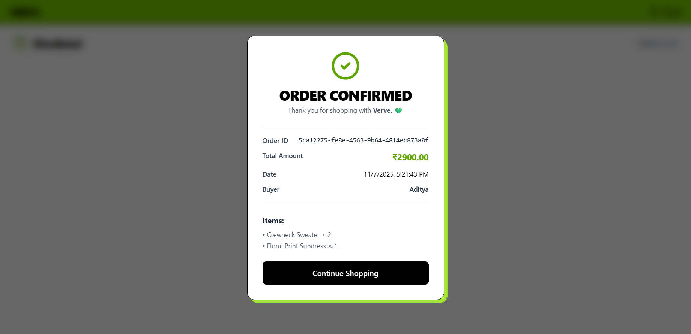

# 🛍️ VERVE — Be the vibe.

Welcome to **Verve**, a modern **fashion e-commerce platform** built to bring you the latest trends in **clothing, footwear, and accessories** — all in one place.

---

## ✨ Features

- 🧥 **Explore the latest trends and collections**
- 👗 **Curated styles** for every mood and occasion
- 🛒 **Add-to-cart and seamless checkout experience**

---

## ⚙️ Setup Instructions

### 🧱 Prerequisites

- Node.js (v18+ recommended)
- npm
- SQLite

### 🪄 Installation

```bash
# 1. Clone the repository
git clone https://github.com/adityas-28/Verve-Fashion.git

# 2. Navigate into the project
cd Verve-Fashion

# 3. Install workspace dependencies
npm install

# 4. Start the backend (development)
cd Backend
npm install
npm run dev
# backend available at http://localhost:8000

# 5. In a new terminal, start the frontend (development)
cd ../Frontend
npm install
npm run dev
# frontend available at http://localhost:5173
```

🧩 Project Structure

```
Verve-Fashion/
|
├── Backend/
│ ├── Src/
│ │ ├── Config/ # SQLite wrapper & DB setup
│ │ ├── Controllers/ # Express route controllers
│ │ ├── Middlewares/ # Async + error handlers
│ │ ├── Models/ # Data access helpers (Cart, Product, Receipt)
│ │ └── Routes/ # API route definitions
│ ├── package.json
| |── server.js
| |── Mock_ECom_Cart_db.db
│ └── README.md
|
├── Frontend/
│ ├── public/
│ │ └── images/ # Product images served statically
│ │
│ ├── src/
│ │ ├── api/ # Axios client & endpoints
│ │ ├── components/ # Reusable UI components
│ │ ├── context/ # Global cart state management
│ │ ├── pages/ # Products, Cart, Checkout screens
│ │ ├── main.jsx
│ │ ├── index.css
│ │ └── App.jsx
│ └── package.json
├── package.json # Workspace-level metadata (if using npm workspaces)
└── README.md # Project overview
```

### 🪞 Screenshots

🏠 Home / Products Page


🛒 Cart Page


💳 Checkout Page


✅ Order Confirmation / Receipt Page


## 🧵 How It Works

Browse Products – Explore a curated list of trendy fashion items.

Add to Cart – Easily add, remove, or adjust quantities.

Checkout – Enter your details and confirm your order.

Receipt Modal – Get a clean order confirmation popup with summary.

---
